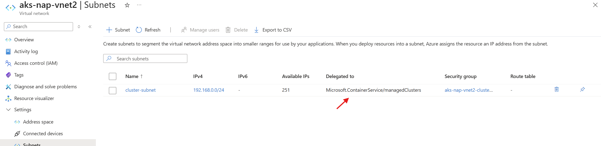
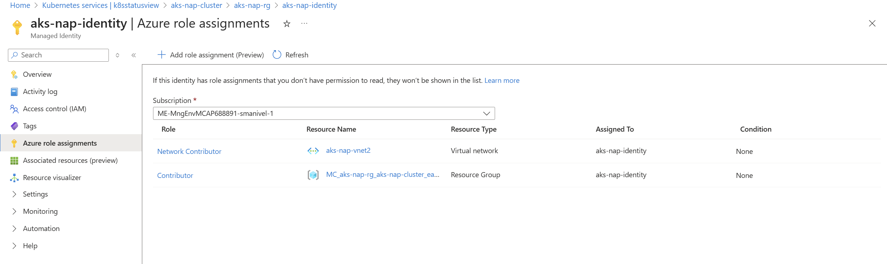
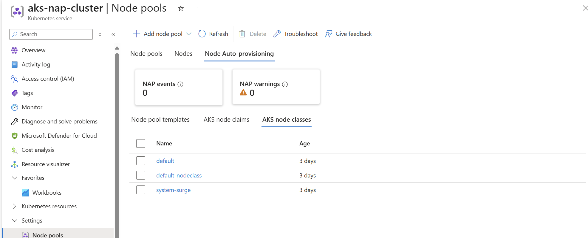
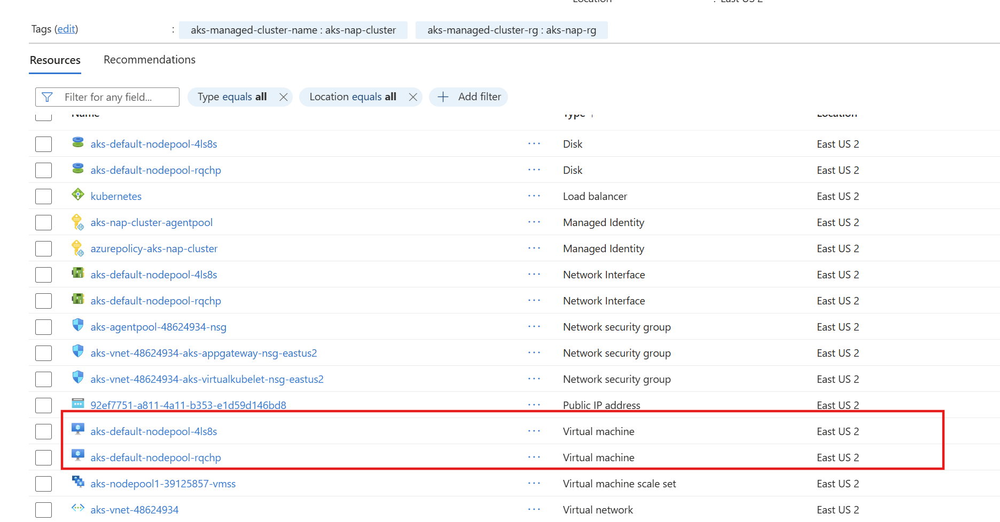
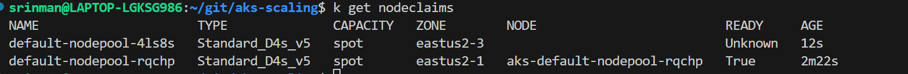
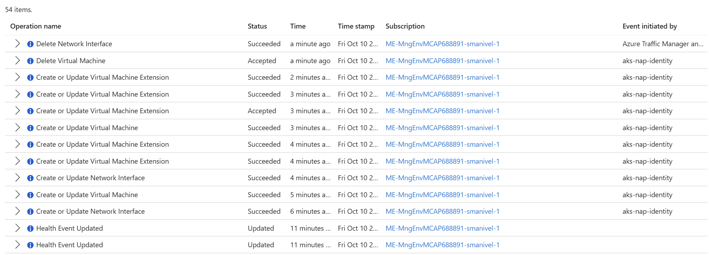

# AKS Node Auto Provisioning (NAP) Deployment Guide

## Overview

Node Auto Provisioning (NAP) is AKS's implementation of the open-source Karpenter project that automatically provisions, scales, and manages virtual machines (nodes) in response to pending pod pressure. NAP uses workload resource requirements to determine the optimal VM configuration for efficiency and cost-effectiveness.

## Prerequisites

- Azure CLI 2.76.0 or later
- Azure subscription with appropriate permissions
- `kubectl` installed and configured

### Check Azure CLI Version
```bash
az --version
# Ensure version is 2.76.0 or later
```

## Key Limitations and Requirements

### Supported Features
- System-assigned or user-assigned managed identity (Service Principals not supported)
- Azure CNI or Azure CNI Overlay networking
- Standard Load Balancer (required)
- Linux nodes only (Windows not supported)


## Step 1: Set Environment Variables

```bash
# Set your deployment variables
export LOCATION="East US 2"
export RG_NAME="aks-nap-rg"
export CLUSTER_NAME="aks-nap-cluster"
export VNET_NAME="aks-nap-vnet2"
export IDENTITY_NAME="aks-nap-identity"
export SUBSCRIPTION_ID=$(az account show --query id -o tsv)

echo "Subscription ID: $SUBSCRIPTION_ID"
echo "Resource Group: $RG_NAME"
echo "Cluster Name: $CLUSTER_NAME"
echo "Location: $LOCATION"
```

## Step 2: Create Resource Group

```bash
# Create resource group
az group create \
    --name $RG_NAME \
    --location "$LOCATION"
```

## Step 3: Create Custom Virtual Network

### Create VNET and Cluster Subnet

```bash
# Create virtual network
az network vnet create \
    --name $VNET_NAME \
    --resource-group $RG_NAME \
    --location "$LOCATION" \
    --address-prefixes 192.168.0.0/16

# Create cluster subnet with delegation for NAP
# Note: API server subnet delegation is required for NAP
az network vnet subnet create \
    --resource-group $RG_NAME \
    --vnet-name $VNET_NAME \
    --name cluster-subnet \
    --address-prefixes 192.168.0.0/24 \
    --delegations Microsoft.ContainerService/managedClusters
```



```bash
# Get subnet IDs
CLUSTER_SUBNET_ID=$(az network vnet subnet show \
    --resource-group $RG_NAME \
    --vnet-name $VNET_NAME \
    --name cluster-subnet \
    --query id -o tsv)


echo "Cluster Subnet ID: $CLUSTER_SUBNET_ID"
```

## Step 4: Create Managed Identity and Assign Permissions

```bash
# Create user-assigned managed identity
az identity create \
    --resource-group $RG_NAME \
    --name $IDENTITY_NAME \
    --location "$LOCATION"

# Get identity details
IDENTITY_ID=$(az identity show \
    --resource-group $RG_NAME \
    --name $IDENTITY_NAME \
    --query id -o tsv)

IDENTITY_PRINCIPAL_ID=$(az identity show \
    --resource-group $RG_NAME \
    --name $IDENTITY_NAME \
    --query principalId -o tsv)

# Assign Network Contributor role on the VNET
az role assignment create \
    --scope "/subscriptions/$SUBSCRIPTION_ID/resourceGroups/$RG_NAME/providers/Microsoft.Network/virtualNetworks/$VNET_NAME" \
    --role "Network Contributor" \
    --assignee $IDENTITY_PRINCIPAL_ID

echo "Identity ID: $IDENTITY_ID"
echo "Identity Principal ID: $IDENTITY_PRINCIPAL_ID"
```


## Step 5: Deploy AKS Cluster with NAP

### Option A: Public Cluster with NAP (Currently Supported)

⚠️ **Important**: You cannot use `--enable-cluster-autoscaler` with `--node-provisioning-mode Auto`. NAP replaces the traditional cluster autoscaler.

```bash
# Create AKS cluster with Node Auto Provisioning enabled
# Note: We create a minimal system node pool and let NAP handle scaling
az aks create \
    --name $CLUSTER_NAME \
    --resource-group $RG_NAME \
    --location "$LOCATION" \
    --assign-identity $IDENTITY_ID \
    --node-provisioning-mode Auto \
    --network-plugin azure \
    --network-plugin-mode overlay \
    --network-dataplane cilium \
    --enable-managed-identity \
    --generate-ssh-keys \
    --node-count 1 \
    --node-vm-size Standard_D2s_v5

echo "AKS cluster '$CLUSTER_NAME' created successfully with NAP enabled"
```

## Step 6: Configure kubectl

```bash
# Get AKS credentials
az aks get-credentials \
    --resource-group $RG_NAME \
    --name $CLUSTER_NAME \
    --overwrite-existing

# Verify connection
kubectl get nodes
kubectl get pods -A
```

## Step 7: Verify NAP Installation

```bash
# Check if NAP is enabled
az aks show \
    --name $CLUSTER_NAME \
    --resource-group $RG_NAME \
    --query "nodeProvisioningProfile.mode" -o tsv

# Should return "Auto"


# Check for NAP api-resources
kubectl  api-resources | grep karp

```

## Step 8: Create Basic AKSNodeClass and NodePool

### Basic AKSNodeClass Configuration

**Review this link for more details on AKSNodeClass**   
https://learn.microsoft.com/en-us/azure/aks/node-autoprovision-aksnodeclass  

An excerpt:   
AKSNodeClass enables configuration of Azure-specific settings for node auto provisioning. Each NodePool must reference an AKSNodeClass using spec.template.spec.nodeClassRef. Multiple NodePools may point to the same AKSNodeClass, allowing you to share common Azure configurations across different node pools.


Compare this with what's possible in regular nodepool:   
https://learn.microsoft.com/en-us/azure/aks/custom-node-configuration?tabs=linux-node-pools   


```bash
kubectl apply -f - <<EOF
apiVersion: karpenter.azure.com/v1beta1
kind: AKSNodeClass
metadata:
  name: default-nodeclass
  annotations:
    kubernetes.io/description: "General purpose AKSNodeClass for Ubuntu2204 nodes"
spec:
  imageFamily: Ubuntu2204
EOF
```

### Explore spec for aksnodeclasses  

```bash
k explain aksnodeclasses.spec
k explain aksnc.spec
k explain aksnodeclasses.spec.imageFamily
```

### Basic NodePool Configuration

```bash
kubectl apply -f - <<EOF
apiVersion: karpenter.sh/v1
kind: NodePool
metadata:
  name: default-nodepool
spec:
  template:
    metadata:
      labels:
        intent: apps
    spec:
      requirements:
        - key: karpenter.sh/capacity-type
          operator: In
          values: [spot, on-demand]
        - key: node.kubernetes.io/instance-type
          operator: In
          values: [Standard_D2s_v5, Standard_D4s_v5, Standard_D8s_v5]  # Specific VM sizes
      nodeClassRef:
        group: karpenter.azure.com
        kind: AKSNodeClass
        name: default-nodeclass
      expireAfter: Never
  limits:
    cpu: 30  # Maximum 30 vCPUs across all nodes in this pool
  disruption:
    consolidationPolicy: WhenEmptyOrUnderutilized
    consolidateAfter: 0s
EOF
```

## Step 9: Test NAP with Sample Workload

### Deploy Test Application

Open a new terminal and issue these commands.  

Watch NAP events in real-time, Check node claims (managed by NAP)

```bash
kubectl get nodeclaims

kubectl get events -A --field-selector source=karpenter -w
``` 

```bash
kubectl apply -f - <<EOF
apiVersion: apps/v1
kind: Deployment
metadata:
  name: nap-test-app
spec:
  replicas: 5
  selector:
    matchLabels:
      app: nap-test
  template:
    metadata:
      labels:
        app: nap-test
    spec:
      containers:
      - name: app
        image: nginx:latest
        resources:
          requests:
            cpu: 500m
            memory: 512Mi
          limits:
            cpu: 1000m
            memory: 1Gi
EOF
```

### Monitor NAP Scaling

```bash
# Watch nodes being created
watch kubectl get nodes

# Monitor NAP events (sorted by timestamp)
kubectl get events -A --field-selector source=karpenter --sort-by='.lastTimestamp'

# Watch NAP events in real-time
kubectl get events -A --field-selector source=karpenter -w

# Check node claims (managed by NAP)
kubectl get nodeclaims

# Check pod scheduling
kubectl get pods -o wide

# Check if pods are pending and why
kubectl get pods -o wide | grep Pending
kubectl describe pods -l app=nap-test | grep -A 10 "Events:"

# Check nodeclaim details for troubleshooting
kubectl describe nodeclaims
```

### Common Troubleshooting Commands

```bash

# Describe NodePool for issues
kubectl describe nodepool default-nodepool

# Check node provisioning issues
kubectl describe nodeclaims

# Verify resource requests and limits
kubectl describe pods -l app=nap-test

# Check available VM SKUs in region
az vm list-skus --location "East US 2" --size Standard_D --output table | grep -v "NotAvailableForSubscription"
```

---

## Step 10: Batch Job Example - Node Provisioning and De-provisioning

This example demonstrates NAP's true power: **automatically provisioning nodes for batch jobs and removing them when complete**. This is ideal for cost optimization with intermittent workloads.

**before proceeding with this example, delete deploy nap-test-app**

### Scenario
- Deploy a batch Job that requires significant resources
- NAP provisions a new node to accommodate the Job
- Job completes and terminates
- NAP automatically removes the node after the configured consolidation period

### Create a Batch Processing Job

This Job simulates a data processing workload that runs for 2 minutes and then completes:

```bash
kubectl apply -f - <<EOF
apiVersion: batch/v1
kind: Job
metadata:
  name: batch-processing-job
spec:
  completions: 3  # Run 3 job instances total
  parallelism: 3  # Run all 3 in parallel
  template:
    metadata:
      labels:
        app: batch-processor
    spec:
      containers:
      - name: processor
        image: busybox:latest
        command:
        - /bin/sh
        - -c
        - |
          echo "Starting batch processing job at \$(date)"
          echo "Job instance: \$HOSTNAME"
          echo "Simulating data processing workload..."
          
          # Simulate CPU-intensive work
          for i in \$(seq 1 120); do
            echo "Processing batch \$i/120..."
            sleep 1
          done
          
          echo "Batch processing completed at \$(date)"
          echo "Job \$HOSTNAME finished successfully"
        resources:
          requests:
            cpu: 1000m      # Request 1 full CPU core
            memory: 1Gi
          limits:
            cpu: 2000m
            memory: 2Gi
      restartPolicy: Never
  backoffLimit: 2
EOF
```

### Monitor Node Provisioning and Job Execution

**In Terminal 1 - Watch Nodes:**
```bash
# Watch nodes being created and removed
watch -n 2 'kubectl get nodes -o wide'
```

**In Terminal 2 - Watch NodeClaims:**
```bash
# Watch NAP creating and removing node claims
watch -n 2 'kubectl get nodeclaims -o wide'
```

**In Terminal 3 - Watch Job Progress:**
```bash
# Monitor job and pod status
watch -n 2 'kubectl get jobs,pods -l app=batch-processor'
```

**In Terminal 4 - Watch NAP Events:**
```bash
# See NAP decision-making in real-time
kubectl get events -A --field-selector source=karpenter -w
```
  
  

### Expected Behavior Timeline

| Time | Event | What NAP Does |
|------|-------|---------------|
| **T+0s** | Job created with 3 pods | NAP detects pending pods |
| **T+5s** | NodeClaim created | NAP calculates optimal VM size |
| **T+30s** | Node provisioned | Azure VM created and joined cluster |
| **T+35s** | Pods scheduled | Job pods start running on new node |
| **T+155s** | Job completes | All 3 job instances finish successfully |
| **T+155s** | Pods terminate | Completed job pods removed |
| **T+155s** | Node becomes empty | NAP marks node for consolidation |
| **T+155s+** | Node deprovisioned | NAP removes empty node (immediate with `consolidateAfter: 0s`) |

### Verify the Lifecycle

```bash
# 1. Check job status
kubectl get jobs batch-processing-job

# Expected output after completion:
# NAME                    COMPLETIONS   DURATION   AGE
# batch-processing-job    3/3           2m15s      3m

# 2. Check if job pods completed
kubectl get pods -l app=batch-processor

# Expected output:
# NAME                          READY   STATUS      RESTARTS   AGE
# batch-processing-job-xxxxx    0/1     Completed   0          3m
# batch-processing-job-xxxxx    0/1     Completed   0          3m
# batch-processing-job-xxxxx    0/1     Completed   0          3m

# 3. Check nodes (should be back to original count)
kubectl get nodes

# 4. Check nodeclaims (should be cleaned up)
kubectl get nodeclaims

# 5. View consolidation events
kubectl get events -A --field-selector source=karpenter --sort-by='.lastTimestamp' | tail -20
```

### Key NAP Events to Look For

```bash
# Filter for specific event types
kubectl get events -A --field-selector source=karpenter | grep -E "Nominated|Launched|Empty|Consolidat"
```

**Example Event Sequence:**
```
# Pod nomination to node
Normal   Nominated    pod/batch-processing-job-xxxxx   Pod should schedule on: nodeclaim/default-nodepool-xyz

# Node provisioning
Normal   Launched     nodeclaim/default-nodepool-xyz   Status condition transitioned, Type: Launched

# Node registered
Normal   Registered   nodeclaim/default-nodepool-xyz   Node registered to cluster

# Job completion triggers consolidation
Normal   Disruption   nodeclaim/default-nodepool-xyz   Disrupting node via empty consolidation

# Node removed
Normal   Deleted      nodeclaim/default-nodepool-xyz   Deleted node
```

### Understanding Consolidation Policy

Our NodePool has `consolidateAfter: 0s`, which means:
- NAP immediately considers empty or underutilized nodes for removal
- Ideal for batch workloads that should not leave idle capacity

**View your consolidation settings:**
```bash
kubectl get nodepool default-nodepool -o yaml | grep -A 5 "disruption:"
```

**Output:**
```yaml
disruption:
  consolidationPolicy: WhenEmptyOrUnderutilized
  consolidateAfter: 0s  # Immediate consolidation
```

### Cost Optimization Demonstration

Calculate the cost savings:

```bash
# Assume Standard_D2s_v5 costs ~$0.096/hour
# Job runs for 2 minutes = 0.033 hours
# Cost with NAP: $0.096 * 0.033 = $0.00317

# Without NAP (node running 24/7):
# Daily cost: $0.096 * 24 = $2.304
# Cost for 2-minute window: Still paying $0.096/hour for full hour

echo "NAP dynamically provisions nodes only when needed!"
echo "For batch workloads, this can reduce costs by 90%+ compared to pre-provisioned capacity"
```

### Advanced: Multiple Jobs with Different Resource Requirements

Deploy jobs with varying resource needs to see NAP select different VM sizes:

```bash
# Small job - NAP may use Standard_D2s_v5
kubectl apply -f - <<EOF
apiVersion: batch/v1
kind: Job
metadata:
  name: small-batch-job
spec:
  template:
    spec:
      containers:
      - name: worker
        image: busybox
        command: ["sh", "-c", "echo 'Small job'; sleep 60"]
        resources:
          requests:
            cpu: 250m
            memory: 256Mi
      restartPolicy: Never
EOF

# Large job - NAP may use Standard_D8s_v5
kubectl apply -f - <<EOF
apiVersion: batch/v1
kind: Job
metadata:
  name: large-batch-job
spec:
  template:
    spec:
      containers:
      - name: worker
        image: busybox
        command: ["sh", "-c", "echo 'Large job'; sleep 60"]
        resources:
          requests:
            cpu: 4000m
            memory: 8Gi
      restartPolicy: Never
EOF

# Watch NAP provision appropriately-sized nodes
kubectl get nodeclaims -o custom-columns=NAME:.metadata.name,INSTANCE-TYPE:.status.instanceType,CAPACITY:.status.capacity
```

### Cleanup Batch Jobs

```bash
# Delete completed jobs
kubectl delete job batch-processing-job small-batch-job large-batch-job

# Verify nodes are consolidated
kubectl get nodes
kubectl get nodeclaims

# Check consolidation events
kubectl get events -A --field-selector source=karpenter | grep -i consolidat
```

### Key Takeaways from Batch Job Example

✅ **Automatic Provisioning**: NAP creates nodes only when pods are pending  
✅ **Right-Sizing**: Selects optimal VM size based on resource requests  
✅ **Automatic Cleanup**: Removes nodes immediately when jobs complete (with `consolidateAfter: 0s`)  
✅ **Cost Efficiency**: Pay only for compute time actually used  
✅ **Zero Configuration**: No need to pre-create node pools or manage capacity  

### When to Use This Pattern

- **CI/CD Pipelines**: Build jobs that run intermittently
- **Data Processing**: ETL jobs, batch analytics, ML training
- **Scheduled Tasks**: Cron jobs, nightly reports, backups
- **Event-Driven Workloads**: Queue-based processing, webhooks
- **Dev/Test Environments**: Workloads that run during business hours only

---

## Key Benefits of NAP

1. **Automatic Right-Sizing**: Selects optimal VM sizes based on workload requirements
2. **Cost Optimization**: Uses spot instances and consolidates underutilized nodes
3. **Zero-to-Scale**: Can scale from 0 nodes to handle workload demands
4. **Simplified Management**: No need to pre-provision node pools with specific VM sizes
5. **Workload-Driven**: Provisions nodes based on actual pod resource requests

## Next Steps

1. **Monitor Costs**: Use Azure Cost Management to track NAP cost optimization
2. **Configure Alerts**: Set up monitoring for node provisioning events
3. **Tune NodePools**: Adjust limits and requirements based on workload patterns
4. **Security**: Implement proper RBAC and Pod Security Standards
5. **Integration**: Integrate with CI/CD pipelines for automated workload deployment

---

## Appendix: Understanding Karpenter and Node Auto Provisioning

### A. Historical Evolution of Node Scaling in Kubernetes

#### Phase 1: Manual Node Management (Pre-2016)
In the early days of Kubernetes, cluster administrators had to:
- Manually provision VMs/nodes
- Manually join nodes to clusters
- Monitor capacity and add nodes reactively
- Result: Over-provisioning (wasted cost) or under-provisioning (performance issues)

#### Phase 2: Cluster Autoscaler (2016-Present)
**Introduction**: Kubernetes Cluster Autoscaler (CA) was introduced to automate node scaling.

**How Cluster Autoscaler Works:**
```
┌─────────────────────────────────────────────────────────────┐
│  1. Pod created with resource requests                      │
│  2. Scheduler cannot place pod (insufficient capacity)      │
│  3. Cluster Autoscaler detects pending pods                 │
│  4. CA selects a pre-defined node pool (node group)         │
│  5. CA instructs cloud provider to add node(s) to pool      │
│  6. Cloud provider provisions VM matching pool spec         │
│  7. Node joins cluster                                      │
│  8. Scheduler places pod on new node                        │
└─────────────────────────────────────────────────────────────┘
```

**Key Architecture:**
- Operates at the **node pool/node group** level
- Requires **pre-defined node pools** with specific VM types
- Scales node pools up/down based on pending pods
- Works by adding/removing nodes from existing pools

**Cluster Autoscaler Architecture Diagram:**

```
┌─────────────────────────────────────────────────────────────────────┐
│                      Kubernetes Cluster                             │
│                                                                     │
│  ┌──────────────┐                                                  │
│  │   Pod (New)  │  ──①──> Pod pending (insufficient capacity)      │
│  └──────────────┘                                                  │
│         │                                                           │
│         ↓                                                           │
│  ┌──────────────────────┐                                          │
│  │  Kube Scheduler      │  ──②──> Cannot place pod                │
│  │                      │         Marks pod as "Pending"           │
│  └──────────────────────┘                                          │
│                                                                     │
│  ┌────────────────────────────────────────────┐                    │
│  │  Cluster Autoscaler (Runs as Deployment)  │                    │
│  │  ┌──────────────────────────────────────┐ │                    │
│  │  │ Scan Loop (every 10s):              │ │                    │
│  │  │  1. Check for pending pods           │ │                    │
│  │  │  2. Evaluate node pools              │ │                    │
│  │  │  3. Select pool to scale             │ │ ──③──> Decision:   │
│  │  │  4. Calculate node count needed      │ │        Scale pool2 │
│  │  └──────────────────────────────────────┘ │        by +2 nodes │
│  └────────────────────────────────────────────┘                    │
│                    │                                                │
└────────────────────┼────────────────────────────────────────────────┘
                     │
                     ↓ ④ API call to cloud provider
         ┌──────────────────────────────────────┐
         │      Azure Resource Manager          │
         │  (Scale VM Scale Set for pool2)      │
         └──────────┬───────────────────────────┘
                    │
                    ↓ ⑤ Provision VMs
    ┌───────────────────────────────────────────────────────┐
    │         Pre-Defined Node Pools (VMSS)                 │
    │                                                       │
    │  ┌─────────────────┐  ┌─────────────────┐           │
    │  │  Pool 1         │  │  Pool 2         │  ← Scale  │
    │  │  Standard_D2s_v5│  │  Standard_D4s_v5│    this   │
    │  │  Min: 1         │  │  Min: 1         │           │
    │  │  Max: 10        │  │  Max: 5         │           │
    │  │  Current: 3     │  │  Current: 1→3   │  +2 nodes │
    │  └─────────────────┘  └─────────────────┘           │
    │                                                       │
    │  ┌─────────────────┐                                 │
    │  │  Pool 3         │                                 │
    │  │  Standard_E8s_v5│                                 │
    │  │  Min: 0         │  ← Not selected                 │
    │  │  Max: 3         │    (wrong VM size)              │
    │  │  Current: 0     │                                 │
    │  └─────────────────┘                                 │
    └───────────────────────────────────────────────────────┘
                    │
                    ↓ ⑥ New nodes join cluster (1-2 minutes)
         ┌──────────────────────────┐
         │  Node: aks-pool2-vm1     │
         │  Node: aks-pool2-vm2     │
         └──────────┬───────────────┘
                    │
                    ↓ ⑦ Scheduler places pod on new node
         ┌──────────────────────────┐
         │   Pod: Running ✓         │
         └──────────────────────────┘

Key Characteristics:
• Operates on pre-defined node pools (VMSS in Azure)
• Must choose from existing pool configurations
• Scaling decision: "Which pool?" and "How many nodes?"
• Limited flexibility: Can only scale pools up/down
• Timeline: 1.5-2 minutes from pending pod to running
```

**Example in AKS:**
```bash
# Pre-create node pools with specific VM sizes
az aks nodepool add --name pool1 --node-vm-size Standard_D2s_v5 --enable-cluster-autoscaler --min-count 1 --max-count 10
az aks nodepool add --name pool2 --node-vm-size Standard_D4s_v5 --enable-cluster-autoscaler --min-count 1 --max-count 5
az aks nodepool add --name pool3 --node-vm-size Standard_E8s_v5 --enable-cluster-autoscaler --min-count 0 --max-count 3
```

#### Phase 3: Karpenter (2021-Present)
**Introduction**: Karpenter was created by AWS (now a CNCF project) to address Cluster Autoscaler limitations.

**Revolutionary Approach:**
- **Node-level provisioning** instead of node pool scaling
- **Dynamic VM selection** based on workload requirements
- **No pre-defined node pools** required
- **Direct cloud provider API integration**

---

### B. Cluster Autoscaler Limitations and Challenges

#### 1. Node Pool Rigidity
**Problem**: Must pre-define all possible VM types in separate node pools.

```bash
# Example: Need to support multiple workload types
az aks nodepool add --name cpu-small --node-vm-size Standard_D2s_v5 --min-count 1 --max-count 10
az aks nodepool add --name cpu-medium --node-vm-size Standard_D4s_v5 --min-count 1 --max-count 10
az aks nodepool add --name cpu-large --node-vm-size Standard_D8s_v5 --min-count 1 --max-count 10
az aks nodepool add --name memory-optimized --node-vm-size Standard_E8s_v5 --min-count 1 --max-count 5
az aks nodepool add --name gpu --node-vm-size Standard_NC6s_v3 --min-count 0 --max-count 3

# Result: Managing 5+ node pools, each with autoscaling configurations
```

**Impact:**
- Operational complexity increases with workload diversity
- Min counts across pools lead to idle capacity (wasted cost)
- Pool proliferation (GPU, CPU, memory-optimized, spot, on-demand, etc.)

#### 2. Bin-Packing Inefficiency
**Problem**: CA scales entire node pools, not optimally-sized individual nodes.

**Example Scenario:**
```yaml
# Pod requests 1.5 CPU cores
resources:
  requests:
    cpu: 1500m

# Cluster has node pool with Standard_D2s_v5 (2 vCPU)
# CA adds a full node even though pod only needs 1.5 cores
# Waste: 0.5 vCPU per node (25% capacity waste)
```

**With multiple diverse workloads:**
- 30% unused capacity across nodes is common
- Leads to significant cloud cost waste

#### 3. Slow Scaling Speed
**Problem**: CA evaluation cycle is slower.

**Typical Timeline:**
1. Pod pending: T+0s
2. CA scan interval (default 10s): T+10s
3. CA decides to scale: T+10s
4. Cloud provider API call: T+15s
5. VM provisioning: T+45s to T+90s
6. Node ready: T+90s to T+120s

**Total**: 1.5-2 minutes for node availability

#### 4. Scale-Down Complexity
**Problem**: Conservative scale-down to avoid disruption.

**CA Scale-Down Rules:**
- Wait 10 minutes after scale-up before considering scale-down
- Only remove nodes below utilization threshold (default 50%)
- Respect PodDisruptionBudgets (good, but adds complexity)
- Cannot remove nodes with certain pod types (local storage, etc.)

**Result**: Nodes linger longer than necessary, increasing costs

#### 5. Multi-Cloud Inconsistency
**Problem**: Each cloud provider implements autoscaling differently.

| Cloud | Node Pool Concept | API Differences |
|-------|-------------------|-----------------|
| AWS | Auto Scaling Groups (ASG) | Different from GCP |
| Azure | VM Scale Sets (VMSS) | Different constraints |
| GCP | Managed Instance Groups (MIG) | Different behaviors |

**Impact**: Different behaviors, capabilities, and limitations per cloud

---

### C. Karpenter: The Next Generation

#### Self-Hosted Karpenter (OSS)

**Architecture:**
```
┌──────────────────────────────────────────────────────┐
│         Karpenter Controller (Pods in Cluster)       │
│                                                      │
│  1. Watches for unschedulable pods                  │
│  2. Calculates optimal node requirements            │
│  3. Directly calls cloud provider APIs              │
│  4. Provisions VMs with exact specs needed          │
│  5. Registers nodes to cluster                      │
└──────────────────────────────────────────────────────┘
```

**NAP (Node Auto Provisioning) Architecture Diagram:**

```
┌─────────────────────────────────────────────────────────────────────┐
│                      AKS Cluster                                    │
│                                                                     │
│  ┌──────────────┐                                                  │
│  │   Pod (New)  │  ──①──> Pod pending (insufficient capacity)      │
│  │   cpu: 1.5   │         resources: {cpu: 1500m, memory: 3Gi}    │
│  │   mem: 3Gi   │                                                  │
│  └──────────────┘                                                  │
│         │                                                           │
│         ↓                                                           │
│  ┌──────────────────────┐                                          │
│  │  Kube Scheduler      │  ──②──> Cannot place pod                │
│  │                      │         Marks pod as "Pending"           │
│  └──────────────────────┘         reason: Unschedulable            │
│                                                                     │
└─────────────────────────────────────────────────────────────────────┘
                     │
                     │ ③ NAP watches for unschedulable pods
                     ↓
┌─────────────────────────────────────────────────────────────────────┐
│               AKS Control Plane (Microsoft-Managed)                 │
│                                                                     │
│  ┌────────────────────────────────────────────────────────────┐   │
│  │         NAP Controller (Managed Karpenter)                 │   │
│  │  ┌──────────────────────────────────────────────────────┐ │   │
│  │  │ Real-Time Decision Engine:                           │ │   │
│  │  │  1. Detect pending pod                               │ │   │
│  │  │  2. Analyze: cpu: 1500m, memory: 3Gi                │ │   │
│  │  │  3. Check NodePool constraints                       │ │   │
│  │  │  4. Calculate optimal VM size ────────────────────┐  │ │   │
│  │  │     Options: D2s_v5 (2cpu), D4s_v5 (4cpu),       │  │ │   │
│  │  │              D8s_v5 (8cpu)                        │  │ │   │
│  │  │     Decision: Standard_D4s_v5 ✓ (best fit)       │  │ │   │
│  │  │  5. Create NodeClaim CRD                          │  │ │   │
│  │  └──────────────────────────────────────────────────┘  │ │   │
│  └────────────────────────────────────────────────────────────┘   │
│                    │                                                │
└────────────────────┼────────────────────────────────────────────────┘
                     │
                     ↓ ④ Direct Azure ARM API call
         ┌──────────────────────────────────────┐
         │      Azure Resource Manager          │
         │  Create specific VM:                 │
         │  • Type: Standard_D4s_v5             │
         │  • OS: Ubuntu 22.04                  │
         │  • Disk: 128GB                       │
         │  • Spot/On-Demand: Dynamic           │
         └──────────┬───────────────────────────┘
                    │
                    ↓ ⑤ Provision single optimized VM (30-60 seconds)
    ┌───────────────────────────────────────────────────────┐
    │         Dynamic Node Provisioning                     │
    │         (No Pre-Defined Pools Required!)              │
    │                                                       │
    │  ┌─────────────────────────────────────────────┐     │
    │  │  NodeClaim: default-nodepool-xyz123         │     │
    │  │  ┌───────────────────────────────────────┐  │     │
    │  │  │  Spec (Calculated by NAP):            │  │     │
    │  │  │  • instanceType: Standard_D4s_v5      │  │     │
    │  │  │  • capacity-type: on-demand           │  │     │
    │  │  │  • imageFamily: Ubuntu2204            │  │     │
    │  │  │  • resources: {cpu: 4, memory: 16Gi}  │  │     │
    │  │  └───────────────────────────────────────┘  │     │
    │  │                                              │     │
    │  │  Status:                                     │     │
    │  │  • Launched: True                            │     │
    │  │  • nodeName: aks-default-xyz123 ───────┐    │     │
    │  └────────────────────────────────────────│────┘     │
    │                                            │          │
    │  ┌─────────────────────────────────────────▼────┐     │
    │  │  Node: aks-default-xyz123                   │     │
    │  │  • VM Size: Standard_D4s_v5 (4 vCPU)       │     │
    │  │  • Memory: 16 GiB                           │     │
    │  │  • Allocatable: {cpu: 3900m, memory: 14Gi} │     │
    │  │  • Labels: {intent: apps, ...}              │     │
    │  └─────────────────────────────────────────────┘     │
    └───────────────────────────────────────────────────────┘
                    │
                    ↓ ⑥ Scheduler places pod on new node
         ┌──────────────────────────────────────┐
         │   Pod: Running ✓                     │
         │   Node: aks-default-xyz123           │
         │   CPU Used: 1.5 / 3.9 available      │
         │   Memory Used: 3Gi / 14Gi available  │
         │                                      │
         │   Efficiency: 90%+ utilization       │
         └──────────────────────────────────────┘
                    │
                    │ ⑦ After pod completes/deleted
                    ↓
         ┌──────────────────────────────────────┐
         │  NAP Consolidation:                  │
         │  • Node empty/underutilized          │
         │  • consolidateAfter: 0s (immediate)  │
         │  • Delete NodeClaim                  │
         │  • Deprovision VM                    │
         │  • Cost savings: $$ ✓                │
         └──────────────────────────────────────┘

Key Characteristics:
• No pre-defined node pools (VMSSs) required
• Dynamic VM size selection per workload
• Optimal bin-packing: 90%+ utilization
• Fast provisioning: 30-60 seconds
• Automatic consolidation: Remove underutilized nodes
• Timeline: 30-60 seconds from pending pod to running
• Managed by Microsoft: Zero operational overhead
```

**Comparison: Cluster Autoscaler vs NAP**

| Aspect | Cluster Autoscaler | NAP (Managed Karpenter) |
|--------|-------------------|-------------------------|
| **Decision Unit** | Node Pool (VMSS) | Individual Node (VM) |
| **Pre-Configuration** | Must create pools upfront | Define policies only |
| **VM Selection** | Fixed per pool | Dynamic per workload |
| **Scaling Question** | "Which pool to scale?" | "What VM size needed?" |
| **Bin-Packing** | Pool-level (70% util.) | Node-level (90%+ util.) |
| **Speed** | 1.5-2 minutes | 30-60 seconds |
| **Flexibility** | Limited to pool configs | Any VM size in policy |
| **Consolidation** | Conservative (10min wait) | Aggressive (configurable) |
| **Operational Overhead** | High (manage many pools) | Low (Microsoft-managed) |
| **Architecture** | External controller → VMSS | Integrated control plane → VM |

**Key Characteristics:**
- Runs as **pods in your cluster** (not external service)
- Uses cloud provider-specific plugins (AWS, Azure, GCP)
- Requires manual installation and management
- Full control over configuration and versions

**Installation Example (Self-Hosted):**
```bash
# Install Karpenter controller
helm upgrade --install karpenter oci://public.ecr.aws/karpenter/karpenter \
    --version v0.35.0 \
    --namespace karpenter \
    --create-namespace

# Create NodePool and NodeClass CRDs
kubectl apply -f nodepool.yaml
kubectl apply -f nodeclass.yaml
```

**Challenges with Self-Hosted:**
- ❌ Manual upgrades and maintenance
- ❌ Requires expertise in Karpenter internals
- ❌ Cloud provider permission configuration
- ❌ Monitoring and logging setup
- ❌ High availability considerations

---

### D. Azure AKS Managed Karpenter: Node Auto Provisioning (NAP)

**What is NAP?**
Node Auto Provisioning (NAP) is Microsoft's **fully managed implementation** of Karpenter for AKS.

#### Key Differences: NAP vs Self-Hosted Karpenter

| Aspect | Self-Hosted Karpenter | AKS NAP (Managed) |
|--------|----------------------|-------------------|
| **Installation** | Manual Helm chart | `--node-provisioning-mode Auto` |
| **Upgrades** | Manual (helm upgrade) | Automatic with AKS |
| **Controller Management** | User-managed pods | Microsoft-managed |
| **Permissions** | Manual IAM/RBAC setup | Automatic with managed identity |
| **High Availability** | User-configured | Managed by Microsoft |
| **Monitoring** | User-configured | Integrated with AKS |
| **Support** | Community | Microsoft Support SLA |
| **Control Plane** | Runs in your cluster | Runs in AKS control plane |
| **Cost** | Free (open source) | Included with AKS |

#### How NAP Works

```
┌───────────────────────────────────────────────────────────────┐
│                    AKS Control Plane                          │
│  ┌─────────────────────────────────────────────────────┐     │
│  │     NAP Controller (Microsoft-Managed)              │     │
│  │  • Watches for unschedulable pods                   │     │
│  │  • Calculates optimal VM size                       │     │
│  │  • Creates NodeClaim CRD                            │     │
│  │  • Provisions Azure VM via ARM API                  │     │
│  │  • Registers node to cluster                        │     │
│  └─────────────────────────────────────────────────────┘     │
└───────────────────────────────────────────────────────────────┘
                            │
                            ↓
         ┌──────────────────────────────────────┐
         │      AKS Cluster (User Nodes)        │
         │                                      │
         │  • NodePool CRDs (user-defined)     │
         │  • AKSNodeClass CRDs (user-defined) │
         │  • NodeClaim CRDs (NAP-created)     │
         │  • Nodes (Azure VMs)                │
         └──────────────────────────────────────┘
```

#### Enable NAP on AKS

**At Cluster Creation:**
```bash
az aks create \
    --name my-cluster \
    --resource-group my-rg \
    --node-provisioning-mode Auto \
    --network-plugin azure
```

**On Existing Cluster:**
```bash
az aks update \
    --name my-cluster \
    --resource-group my-rg \
    --node-provisioning-mode Auto
```

**Benefits:**
✅ Zero operational overhead  
✅ Automatic updates with AKS version  
✅ Integrated monitoring and diagnostics  
✅ Microsoft support included  
✅ Optimized for Azure-specific features  

---

### E. Custom Resource Definitions (CRDs) in AKS Managed Karpenter

NAP uses the following Karpenter CRDs:

#### 1. **NodePool** (karpenter.sh/v1)
**Purpose**: Defines the template and constraints for node provisioning.

**Ownership**: Created by **Platform Administrators**

**Spec Fields:**
```yaml
apiVersion: karpenter.sh/v1
kind: NodePool
metadata:
  name: default-nodepool
spec:
  template:
    metadata:
      labels:
        team: platform      # Custom labels for nodes
    spec:
      requirements:         # Constraints for VM selection
        - key: karpenter.sh/capacity-type
          operator: In
          values: [spot, on-demand]
        - key: node.kubernetes.io/instance-type
          operator: In
          values: [Standard_D2s_v5, Standard_D4s_v5]
        - key: kubernetes.io/arch
          operator: In
          values: [amd64]
      nodeClassRef:         # Reference to AKSNodeClass
        group: karpenter.azure.com
        kind: AKSNodeClass
        name: default-nodeclass
      taints:               # Node taints for pod affinity
        - key: workload-type
          value: batch
          effect: NoSchedule
      expireAfter: 720h     # Node max lifetime (30 days)
  limits:                   # Resource limits across all nodes
    cpu: "100"
    memory: 200Gi
  disruption:               # Consolidation behavior
    consolidationPolicy: WhenEmptyOrUnderutilized
    consolidateAfter: 30s
```

**Key Responsibilities:**
- Define VM selection constraints
- Set resource limits for the pool
- Configure disruption policies
- Link to AKSNodeClass

#### 2. **AKSNodeClass** (karpenter.azure.com/v1beta1)
**Purpose**: Azure-specific configuration for nodes (OS, disk, networking).

**Ownership**: Created by **Platform Administrators**

**Spec Fields:**
```yaml
apiVersion: karpenter.azure.com/v1beta1
kind: AKSNodeClass
metadata:
  name: default-nodeclass
spec:
  imageFamily: Ubuntu2204              # OS image
  osDiskSizeGB: 128                    # OS disk size
  tags:                                # Azure resource tags
    Environment: Production
    CostCenter: Engineering
```

**Supported Specs in AKS NAP vs OSS Karpenter:**

| Field | OSS Karpenter (AWS) | AKS NAP (Azure) | Notes |
|-------|---------------------|-----------------|-------|
| **imageFamily** | ✅ AL2, Bottlerocket, Ubuntu | ✅ Ubuntu2204, AzureLinux | Azure-specific image families |
| **osDiskSizeGB** | ✅ Custom disk size | ✅ Custom disk size | Supported in both |
| **tags** | ✅ AWS tags | ✅ Azure tags | Cloud-specific tagging |
| **userData** | ✅ Custom startup scripts | ❌ Not supported | NAP uses managed bootstrap |
| **blockDeviceMappings** | ✅ Custom EBS config | ❌ Not supported | Azure uses managed disks |
| **instanceProfile** | ✅ AWS IAM roles | ❌ N/A | Azure uses managed identity |
| **subnetSelector** | ✅ Subnet selection | ❌ N/A | NAP uses cluster subnet |
| **securityGroupSelector** | ✅ SG selection | ❌ N/A | NAP uses cluster NSG |
| **amiFamily** | ✅ AMI selection | ❌ N/A | Azure equivalent: imageFamily |

**Why fewer options in NAP?**
- Microsoft manages security and networking configurations
- Ensures compliance with AKS best practices
- Simplifies management for most use cases
- Reduces misconfiguration risks

#### 3. **NodeClaim** (karpenter.sh/v1beta1)
**Purpose**: Represents a request for a node with specific requirements.

**Ownership**: Created **automatically by NAP controller** (not by users)

**Analogy: NodeClaim is to Nodes as PVC is to PVs**

```yaml
apiVersion: karpenter.sh/v1beta1
kind: NodeClaim
metadata:
  name: default-nodepool-abc123
  labels:
    karpenter.sh/nodepool: default-nodepool
spec:
  requirements:               # Inherited from NodePool
    - key: karpenter.sh/capacity-type
      operator: In
      values: [on-demand]
    - key: node.kubernetes.io/instance-type
      operator: In
      values: [Standard_D4s_v5]
  nodeClassRef:
    name: default-nodeclass
  resources:                  # Calculated by NAP
    requests:
      cpu: "2"
      memory: 4Gi
status:
  conditions:
    - type: Launched
      status: "True"
  nodeName: aks-default-nodepool-abc123  # Bound node
  allocatable:
    cpu: "1900m"            # Actual available after system overhead
    memory: 3.5Gi
```

---

### F. NodeClaim vs PVC: A Detailed Comparison

Both NodeClaim and PersistentVolumeClaim (PVC) follow similar **request → provision → bind** patterns.

#### Comparison Table

| Aspect | **PersistentVolumeClaim (PVC)** | **NodeClaim** |
|--------|--------------------------------|---------------|
| **What it requests** | Storage volume | Compute node (VM) |
| **Created by** | **Application Developers** | **NAP Controller (automatic)** |
| **Who defines templates** | Platform Admins (StorageClass) | Platform Admins (NodePool + AKSNodeClass) |
| **Trigger** | Developer creates PVC manifest | Pod becomes unschedulable |
| **Provisioner** | CSI driver (azure-disk, azure-file) | NAP controller |
| **Binds to** | PersistentVolume (PV) | Node |
| **Binding process** | PV controller binds PVC → PV | NAP binds NodeClaim → Node |
| **User visibility** | ✅ Developers see and create PVCs | ❌ Users don't create NodeClaims directly |
| **Lifecycle** | Exists until PVC deleted | Exists while node is active |
| **Deletion** | Manual (kubectl delete pvc) | Automatic when node is deprovisioned |

#### Visual Workflow Comparison

**PVC Workflow:**
```
┌──────────────────┐
│  1. Developer    │  Creates PVC manifest
│  creates PVC     │  apiVersion: v1, kind: PersistentVolumeClaim
└────────┬─────────┘
         │
         ↓
┌──────────────────┐
│  2. CSI Driver   │  Provisions storage in cloud
│  provisions PV   │  Creates PersistentVolume object
└────────┬─────────┘
         │
         ↓
┌──────────────────┐
│  3. PV Controller│  Binds PVC to PV
│  binds PVC→PV    │  Updates status.phase: Bound
└────────┬─────────┘
         │
         ↓
┌──────────────────┐
│  4. Pod uses     │  volumeMounts reference PVC
│  mounted volume  │  Data persists across pod restarts
└──────────────────┘
```

**NodeClaim Workflow:**
```
┌──────────────────┐
│  1. Developer    │  Creates Pod with resource requests
│  creates Pod     │  resources: {cpu: 2, memory: 4Gi}
└────────┬─────────┘
         │
         ↓
┌──────────────────┐
│  2. Scheduler    │  Cannot place pod (insufficient capacity)
│  marks pending   │  Pod status: Pending
└────────┬─────────┘
         │
         ↓
┌──────────────────┐
│  3. NAP detects  │  Automatically creates NodeClaim
│  pending pod     │  Calculates requirements from pod spec
└────────┬─────────┘
         │
         ↓
┌──────────────────┐
│  4. NAP provisions│ Calls Azure API to create VM
│  Azure VM        │  Selects optimal VM size from NodePool
└────────┬─────────┘
         │
         ↓
┌──────────────────┐
│  5. VM joins as  │  NodeClaim binds to Node
│  Node in cluster │  NodeClaim.status.nodeName = node-name
└────────┬─────────┘
         │
         ↓
┌──────────────────┐
│  6. Scheduler    │  Binds pod to new node
│  places pod      │  Pod status: Running
└──────────────────┘
```

#### Key Difference in Persona

| Resource | Created By | Managed By | Visible To |
|----------|-----------|------------|------------|
| **StorageClass** | Platform Admin | Platform Admin | App Developers (reference in PVC) |
| **PVC** | **App Developer** | App Developer | App Developers |
| **PV** | CSI Driver (automatic) | Platform Admin | Platform Admins |
| **NodePool** | Platform Admin | Platform Admin | Platform Admins |
| **AKSNodeClass** | Platform Admin | Platform Admin | Platform Admins |
| **NodeClaim** | **NAP Controller (automatic)** | NAP Controller | Platform Admins (for debugging) |
| **Node** | NAP Controller (automatic) | NAP Controller | Platform Admins |

**Why developers don't create NodeClaims:**
- NodeClaims are an **implementation detail** of the provisioning process
- Developers express needs through **pod resource requests**
- NAP abstracts the complexity of node provisioning
- Similar to how developers don't manually create PVs (they create PVCs)

---

### G. NAP Interaction with Kubernetes Scheduler

**Question: Does NAP interact directly with the Kubernetes scheduler?**

**Answer: No, NAP works similarly to Cluster Autoscaler—it operates independently but collaborates with the scheduler.**

#### How NAP and Scheduler Collaborate

```
┌─────────────────────────────────────────────────────────┐
│            Kubernetes Control Plane                     │
│                                                         │
│  ┌──────────────────┐       ┌──────────────────┐      │
│  │   Scheduler      │       │  NAP Controller  │      │
│  │                  │       │                  │      │
│  │  1. Tries to     │       │  2. Watches for  │      │
│  │     schedule pod │       │     unschedulable│      │
│  │  2. Fails (no    │       │     pods         │      │
│  │     capacity)    │       │  3. Creates      │      │
│  │  3. Marks pod    │◄──────┤     NodeClaim    │      │
│  │     Pending      │       │  4. Provisions   │      │
│  │  4. Retries when │       │     Node         │      │
│  │     new node     │       │                  │      │
│  │     available    │       │                  │      │
│  └──────────────────┘       └──────────────────┘      │
│           │                          │                 │
│           │                          │                 │
│           ↓                          ↓                 │
│  ┌────────────────────────────────────────────┐       │
│  │         Node (Azure VM)                    │       │
│  │  • Pod scheduled here after provisioning   │       │
│  └────────────────────────────────────────────┘       │
└─────────────────────────────────────────────────────────┘
```

#### Step-by-Step Process

1. **Developer creates Pod**
   ```bash
   kubectl apply -f pod.yaml
   ```

2. **Scheduler attempts placement**
   - Evaluates all existing nodes
   - Checks: CPU, memory, taints, affinity rules, topology constraints
   - **Result**: No node has sufficient capacity

3. **Scheduler marks Pod as Pending**
   ```yaml
   status:
     phase: Pending
     conditions:
       - type: PodScheduled
         status: "False"
         reason: Unschedulable
         message: "0/3 nodes are available: insufficient cpu"
   ```

4. **NAP detects unschedulable Pod**
   - Watches for Pods with `status.conditions.reason: Unschedulable`
   - Analyzes pod's resource requests and constraints
   - Checks if a NodePool can satisfy requirements

5. **NAP creates NodeClaim**
   ```bash
   # NAP automatically creates this:
   kubectl get nodeclaims
   NAME                         NODEPOOL          NODENAME                        READY
   default-nodepool-abc123      default-nodepool  aks-default-nodepool-abc123    True
   ```

6. **NAP provisions Azure VM**
   - Calculates optimal VM size (e.g., Standard_D4s_v5)
   - Calls Azure Resource Manager API
   - VM boots and joins cluster as a Node

7. **Scheduler retries placement**
   - Detects new Node is available
   - Re-evaluates Pod placement
   - **Success**: Binds Pod to new Node

8. **Pod starts running**
   ```bash
   kubectl get pods
   NAME      READY   STATUS    RESTARTS   AGE   NODE
   my-pod    1/1     Running   0          45s   aks-default-nodepool-abc123
   ```

#### Key Takeaway

**NAP does NOT replace or modify the scheduler.** It works as a **capacity provider**:
- Scheduler handles **placement decisions** (which pod goes on which node)
- NAP handles **capacity decisions** (when to add nodes and what size)

This is the same relationship that Cluster Autoscaler has with the scheduler.

---

### H. Summary: Why NAP is Superior

| Challenge | Cluster Autoscaler | AKS NAP (Managed Karpenter) |
|-----------|-------------------|----------------------------|
| **Node pool management** | Manual creation of multiple pools | Define requirements in NodePool CRD |
| **VM size selection** | Fixed per pool | Dynamic based on workload |
| **Bin-packing efficiency** | 70% average utilization | 90%+ utilization |
| **Scaling speed** | 1.5-2 minutes | 30-60 seconds |
| **Consolidation** | Conservative, slow | Aggressive, configurable |
| **Operational overhead** | High (manage many pools) | Low (define policies) |
| **Cloud provider differences** | Inconsistent | Azure-optimized |
| **Maintenance** | Manual updates | Automatic with AKS |

---

### I. Quick Reference: CRD Ownership Model

```
Platform Administrator Creates:
├── NodePool (defines VM selection rules)
└── AKSNodeClass (defines Azure-specific config)

NAP Controller Automatically Creates:
├── NodeClaim (request for a specific node)
└── Node (actual Azure VM in cluster)

Application Developer Creates:
└── Pod (with resource requests) ← This triggers the entire flow
```

---

## References

- [Microsoft NAP Documentation](https://learn.microsoft.com/en-us/azure/aks/node-autoprovision)
- [Karpenter Documentation](https://karpenter.sh/)
- [AKS Karpenter Provider](https://github.com/Azure/karpenter-provider-azure)
- [NAP Networking Configuration](https://learn.microsoft.com/en-us/azure/aks/node-autoprovision-networking)
- [NAP Disruption Policies](https://learn.microsoft.com/en-us/azure/aks/node-autoprovision-disruption)
- [Kubernetes Cluster Autoscaler](https://github.com/kubernetes/autoscaler/tree/master/cluster-autoscaler)
- [Karpenter Best Practices](https://karpenter.sh/docs/concepts/)
